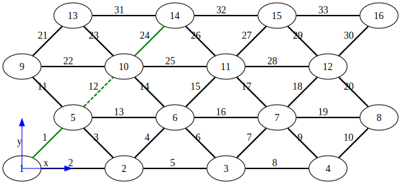
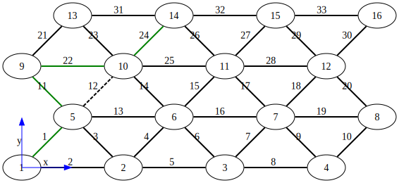
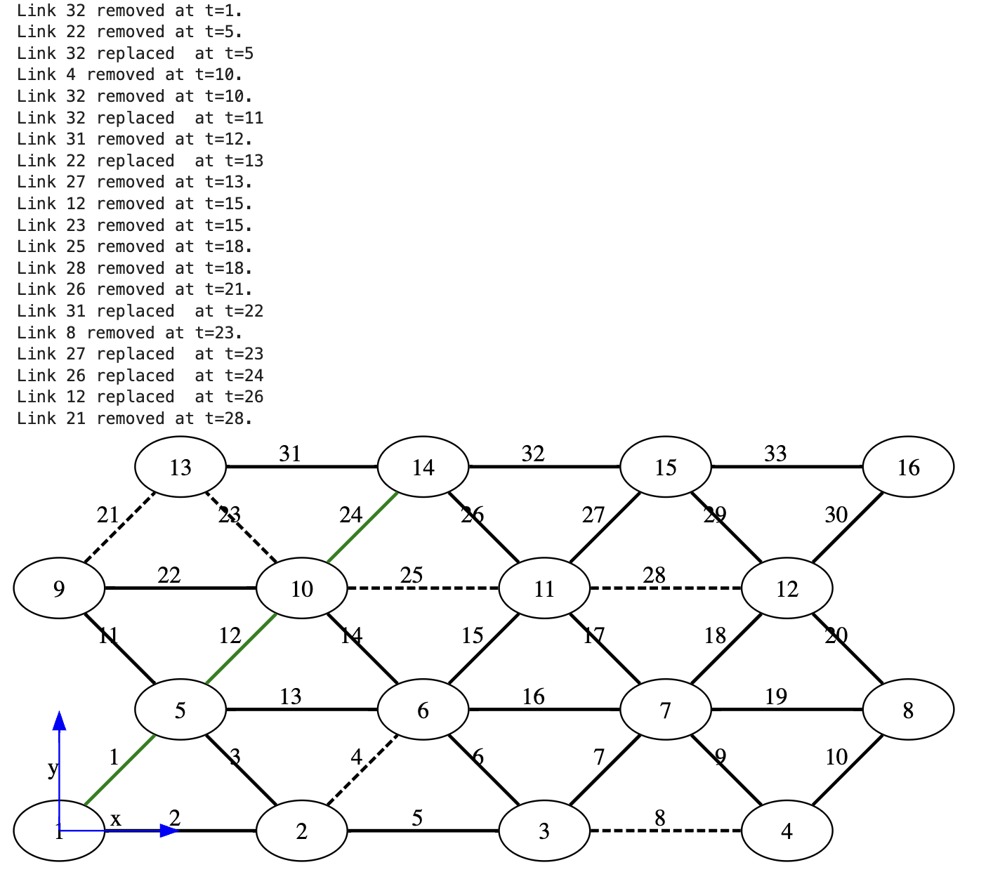
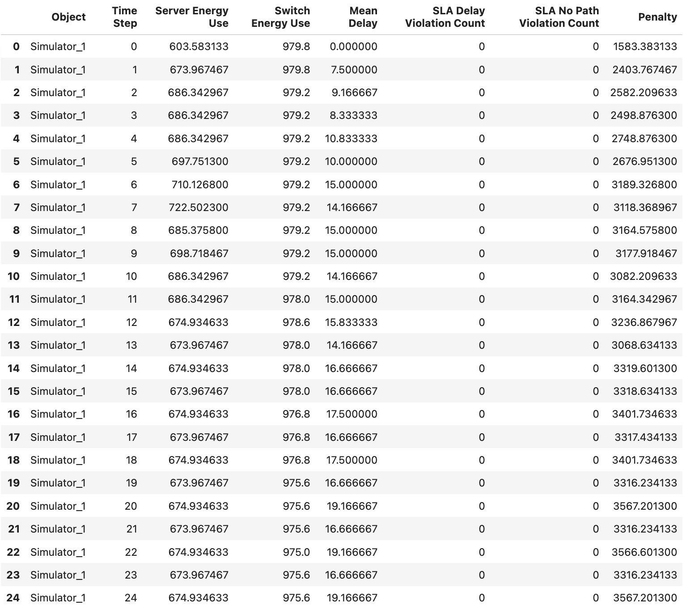

# Chaos Resilient Edge Network
Simulation of edge computing network that autonomously distributes resources to maximize delivery on service level agreements

## What it is

An extension of [EdgeSimPy](https://github.com/EdgeSimPy/EdgeSimPy), a simulator of edge server networks, that includes service level agreement relevant metrics of network performance. 

### SLA metrics

Let
- $E$ be energy consumption of the network (excluding user equipment) 
- $D$ be the mean of delays (latency) 
    - the mean is over all current applications running for all users
- $V$ be the count of SLA violations in the form of current delay for the app being greater than SLA for the app/customer combination
    - the sum is over all application of all users 
- $N$ be the count of SLA violations in the form of routing (with finite time) not being an option.
    - If it is not possible to find a route for an app, then the SLA violation is fundamentally different from an over budget delay violation.

The for some $(d,v)\in\mathbb{R}_+^2$ the model uses
$$
\text{Reward} =-\text{Penalty} = - E - dD - vV -nN
$$
where 
- $d$ is the value of reducing mean latency by 1ms in terms of energy
- $v$ is the relative value of avoiding a delay SLA violation in terms of energy
    - e.g. $v=10$  means that it is worth expending 10 times the energy to avoid a delay SLA violation instead of reducing mean latency by 1ms.
- $n$ is the value of avoiding an inability to create a flow for an app in terms of energy
    - e.g. $n=100$ means that it is worth expending 100 times the energy to avoid a connection SLA violation instead of reducing mean latency by 1ms.

## What it will be

The goal of the project is for a reinforcement learning agent on top of the simulation to learn to make optimal decisions about allocation of resources in a variety of ways listed below.
- Which server hosts which application
- Where docker images for instances of application servers are held 
- Which path from application server to user's base station to use. 

The idea is to augment the resource allocating RL agent created by DISH Wireless's Scientific Staff in [FONPR](https://github.com/DISHDevEx/fonpr) (the first open network patter reactor.)

## How it works
A network of edge hosts exists to serve users' applications needs. Edge hosts are colocated with base stations (though this configuration is optional; base stations without edge hosts). Each edge host is running servers for some but not all applications. 

### Connections through routes
When a user accesses and application, a path from one of the edge hosts serving that application to the base station serving the user is chosen (currently by choosing the path with minimum delay, but the RL agent will make this choice in the final version.) The image below shows an example network with a geographical layout of 16 edge hosts and 33 links between them. In green, a path from host 1 to host 14 has been created to serve an application for a user connected to the base station collocated with host 14. The path consists of three links. 

### Broken connections
The dashed green line at link 12 indicates that at the current time in the simulation the route assigned to the app includes link 12, but that link 12 is not currently working. In this situation, the user's app is not being served. 

### Rerouting 

A new route is chosen in the next simulation time step. In the current version, the route with the lowest latency is assigned. The result is a path with higher delay than if the link had not broken. The reason for the increased delay is that the sum of delays over the constituent links is now larger than for the previous route.

### Chaos

Links are broken at random at each time step. Links are also repaired at each time step. The result is a system in which rerouting of each app being served needs to be reconsidered at each time step.  

### Metrics 

At each time step, the service level metrics are recorded. These are to be passed to the RL agent for training and, after training, autonomous control over the features of the network listed above

 

